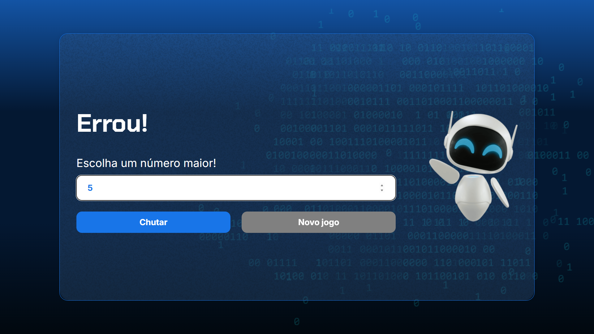

# 🎮 Jogo do Número Secreto


<table align="center">
  <tr>
    <td></td>
    <td></td>
  </tr>
  <tr>
    <td></td>
    <td></td>
  </tr>
</table>


Um jogo simples desenvolvido com **HTML**, **CSS** e **JavaScript**, onde o objetivo é adivinhar o número secreto gerado aleatoriamente pelo sistema.

## 📌 Links
* [Repositório](https://github.com/Leonardo-Daniel-SC/Jogo-numero-secreto)
* [Site Publicado](https://leonardo-daniel-sc.github.io/Jogo-numero-secreto/)
---

## 📖 Sobre o projeto

Este projeto foi focado em desenvolver conceitos fundamentais de JavaScript, como:

* Manipulação do DOM
* Eventos
* Funções
* Condições
* Laços de repetição
* Geração de números aleatórios
* Validação de entradas
* Interação com o usuário

Além disso, o jogo utiliza a biblioteca **ResponsiveVoice** para realizar a leitura em voz das mensagens exibidas na tela.

---

## 🚀 Funcionalidades

* 🎲 Geração automática de um número secreto.
* 🔢 Campo para inserir o palpite.
* ✅ Validação dos números digitados.
* 📢 Dicas informando se o número secreto é maior ou menor.
* 🔊 Feedback por voz utilizando ResponsiveVoice.
* 🔄 Botão para iniciar uma nova partida.
* 📱 Interface simples e responsiva.

---

## 🛠️ Tecnologias utilizadas

* HTML5
* CSS3
* JavaScript
* ResponsiveVoice API

---

## 📂 Estrutura do projeto

```text
📁 projeto
│
├── index.html
├── style.css
├── app.js
│
├── img/
│   └── ia.webp
│
└── README.md
```

---

## ▶️ Como executar

1. Clone este repositório:

```bash
git clone https://github.com/seu-usuario/nome-do-repositorio.git
```

2. Entre na pasta do projeto:

```bash
cd nome-do-repositorio
```

3. Abra o arquivo **index.html** em qualquer navegador.

Ou utilize a extensão **Live Server** no Visual Studio Code.

---

## 💡 Como jogar

1. Digite um número no campo.
2. Clique em **Chutar**.
3. O jogo informará se o número secreto é maior ou menor.
4. Continue tentando até acertar.
5. Ao vencer, clique em **Novo jogo** para jogar novamente.

---

## 📚 Aprendizados

Durante o desenvolvimento deste projeto foram praticados:

* Seleção de elementos do DOM
* Atualização dinâmica de conteúdo
* Eventos de clique
* Estruturas condicionais
* Funções reutilizáveis
* Boas práticas de organização do código

---
